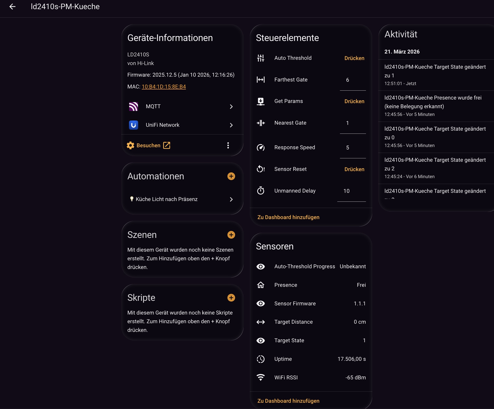
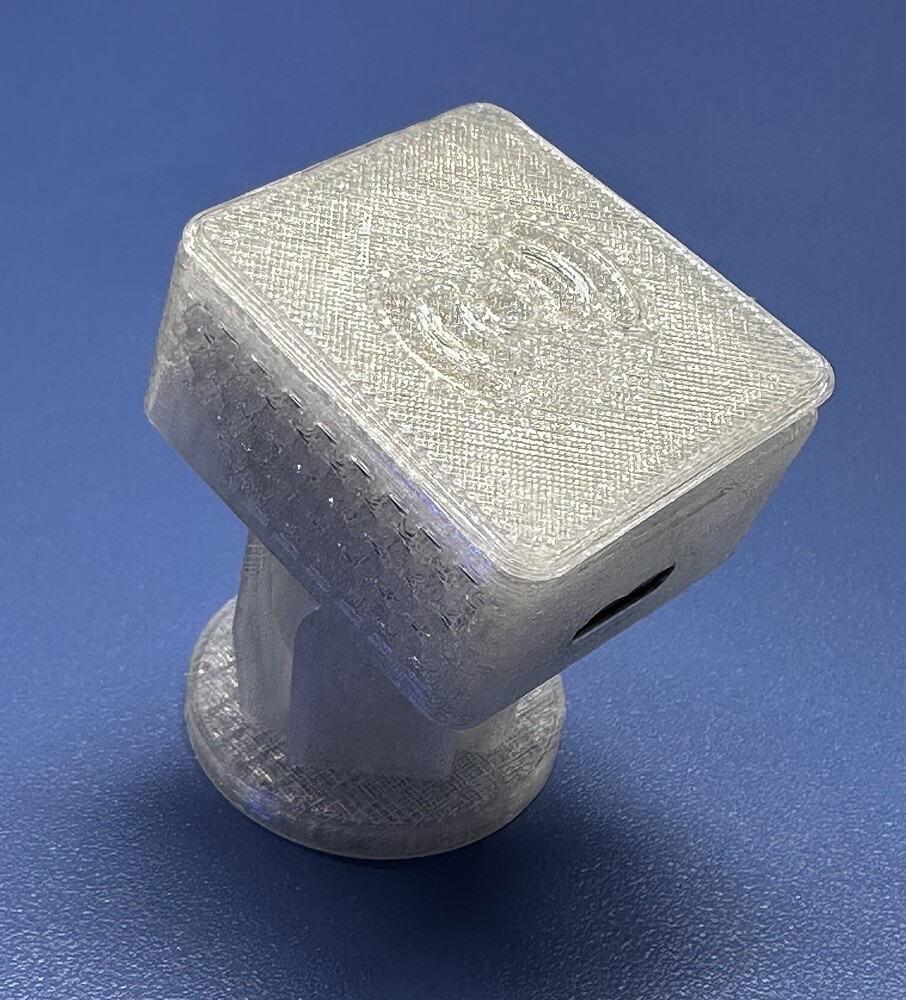

# LD2410S C3 Mini MQTT
  .     

Firmware für den ESP32-C3 mit HLK-LD2410S Radar-Sensor. Das Gerät erkennt Personen im Raum, misst den Abstand und meldet alles automatisch an Home Assistant – ohne manuelle Konfiguration dort.



Die Einrichtung erfolgt einmalig über ein integriertes Web-Portal. Danach ist das Gerät vollständig über Home Assistant steuerbar.

---
## Gehäuse

👉  [`docs/gehaeuse.md`](docs/gehaeuse.md) – 3D-gedrucktes Gehäuse, Bilder und Druckdatei  
  <a href="docs/gehaeuse.md">
    
  </a>


## Kurzanleitung

1. Sensor und ESP32 verdrahten (siehe [Verdrahtung](#verdrahtung))
2. Firmware aus `bin/firmware.bin` auf den ESP32 flashen (siehe [`docs/INSTALLATION.md`](docs/INSTALLATION.md))
3. Mit dem WLAN **`LD2410S-Setup`** (Passwort: `ld2410s-setup`) verbinden
4. Im Browser **`http://192.168.4.1`** öffnen
5. WLAN- und MQTT-Zugangsdaten eintragen und speichern
6. Das Gerät startet neu und erscheint automatisch in Home Assistant

---

## Was das Gerät kann

- Erkennt Anwesenheit von Personen per Radar
- Misst den Abstand zur erkannten Person in Zentimetern
- Sendet alle Messwerte per MQTT an Home Assistant
- Richtet sich dort vollautomatisch ein (MQTT Auto Discovery)
- Sensorparameter (Reichweite, Empfindlichkeit) direkt in Home Assistant einstellbar
- Firmware-Updates über WLAN (OTA), kein USB-Kabel nötig (nur über PlatformIO!)
- Unterstützt mehrere Geräte gleichzeitig im selben Netzwerk

---

## Verdrahtung

Standardbelegung für den LOLIN C3 Mini:

```text
LD2410S          ESP32-C3
──────────────────────────
VCC         →    3V3
GND         →    GND
OT1 / TX    →    GPIO 4   (Sensor-Datenausgang → ESP-Eingang)
RX          →    GPIO 6   (ESP-Ausgang → Sensor-Eingang)
```

Die Status-LED liegt standardmäßig auf **GPIO 8**.

> **Hinweis:** Der LOLIN C3 Mini hat auf GPIO 7 eine interne RGB-LED, die mit dem Sensor-Eingang kollidiert. Die Firmware nutzt deshalb GPIO 4 als Standard für den Sensor-Eingang und GPIO 8 für die Status-LED. Andere Pins können jederzeit im Einrichtungsportal geändert werden.

---

## Einrichtungsportal

Beim ersten Start öffnet das Gerät einen eigenen WLAN-Hotspot:

- **WLAN-Name:** `LD2410S-Setup`
- **Passwort:** `ld2410s-setup`
- **Adresse:** `http://192.168.4.1`

Dort werden WLAN, MQTT und optionale Einstellungen eingetragen. Nach dem Speichern verbindet sich das Gerät, zeigt kurz die bezogene IP-Adresse an und startet neu.

---

## Home Assistant

Sobald das Gerät den MQTT-Broker erreicht, erscheinen folgende Einträge automatisch in Home Assistant:

**Messwerte (nur lesbar):**
- Presence – Anwesenheit erkannt / nicht erkannt
- Target Distance – Abstand in cm
- Target State – Erkennungsstatus des Sensors
- Sensor Firmware – Firmware-Version des LD2410S
- WiFi RSSI – WLAN-Signalstärke
- Uptime – Laufzeit seit letztem Neustart

**Sensorparameter (einstellbar):**
- Farthest Gate – maximale Erkennungsreichweite (1–16, je Gate ≈ 0,7 m)
- Nearest Gate – minimale Erkennungsreichweite (0–16)
- Unmanned Delay – Wartezeit bis „keine Anwesenheit" gemeldet wird (10–120 s)
- Response Speed – Reaktionsgeschwindigkeit (5 = Normal, 10 = Schnell)

**Schaltflächen:**
- Get Params – liest die aktuellen Sensor-Werte und aktualisiert die Anzeige
- Auto Threshold – startet die automatische Kalibrierung
- Sensor Reset – setzt den LD2410S auf Werkseinstellungen zurück

### Mehrere Geräte

Mehrere Geräte im selben Netzwerk werden unterstützt. Damit sie sich nicht gegenseitig stören:

- **MQTT Client-ID** muss pro Gerät eindeutig sein (z. B. `ld2410s-wohnzimmer`)
- **MQTT Topic-Prefix** muss pro Gerät eindeutig sein (z. B. `ld2410s/wohnzimmer`)

Die Entity-IDs in Home Assistant werden automatisch anhand der MAC-Adresse des jeweiligen Geräts vergeben.

---

## MQTT-Topics

Alle Topics beginnen mit dem konfigurierten Prefix, zum Beispiel `ld2410s/wohnzimmer`.

| Topic | Inhalt |
|---|---|
| `.../state` | JSON mit `presence`, `target_state`, `distance_cm`, `rssi`, `uptime_s` |
| `.../presence` | `ON` oder `OFF` |
| `.../info` | JSON mit `sensor_fw`, `chip`, `client_id` |
| `.../params` | Aktuelle Sensorparameter als JSON |
| `.../status` | `online` oder `offline` |
| `.../cmd/ack` | Antwort auf Befehle |

---

## Zurücksetzen / Wiederherstellung

### BOOT-Button beim Einschalten gedrückt halten

Das Gerät öffnet sofort das Einrichtungsportal, ohne die vorhandene Konfiguration zu löschen.

### BOOT-Button im Betrieb 3 Sekunden gedrückt halten

- Gespeicherte Konfiguration wird vollständig gelöscht
- Gerät startet neu und öffnet das Einrichtungsportal

Das ist der einfachste Weg, ein falsch konfiguriertes Gerät ohne PC zurückzusetzen.

---

## Dokumentation

- [`docs/INSTALLATION.md`](docs/INSTALLATION.md) – Schritt-für-Schritt: Verdrahtung, Flashen, Ersteinrichtung
- [`docs/README_PARAMETER.md`](docs/README_PARAMETER.md) – Alle Einstellungen und Parameter erklärt


---

## Lizenz
- [`LICENSE`](LICENSE) - MIT
