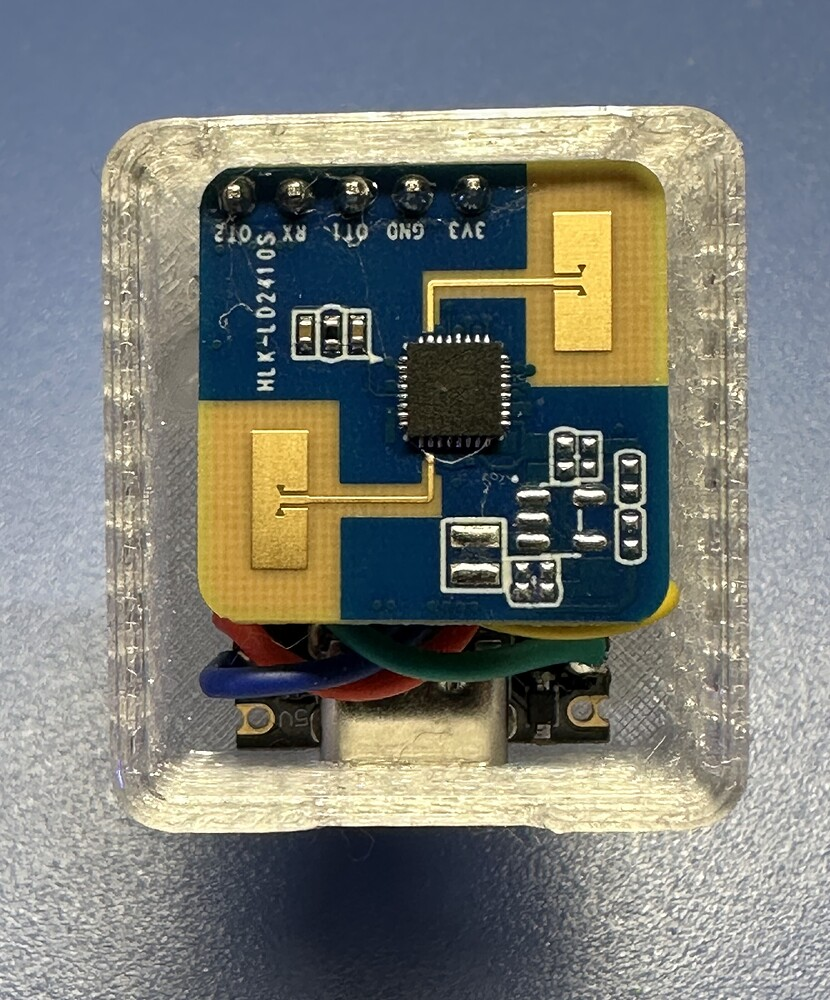
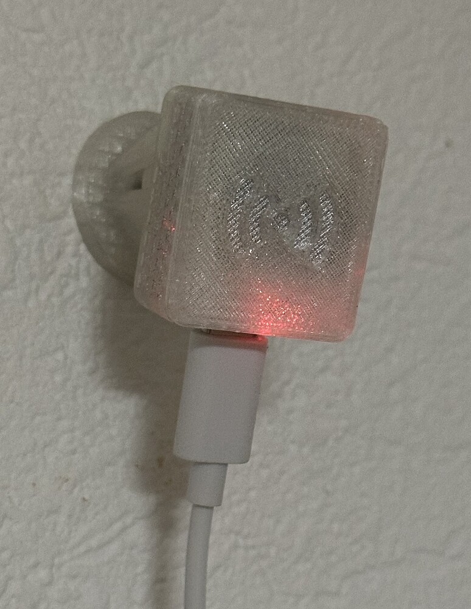

# 3D-gedrucktes Gehäuse

## Beschreibung

Für dieses Projekt wurde ein kompaktes, 3D-gedrucktes Gehäuse entwickelt, das speziell auf den ESP32-C3 Mini und das LD2410S-Modul abgestimmt ist.

Das Gehäuse erfüllt mehrere Aufgaben:

- Schutz der Elektronik
- Saubere Kabelführung (USB-C)
- Minimale Beeinflussung der Radar-/Funkfunktion
- Einfache Montage an Wand oder Oberfläche
- Visuelle Kennzeichnung durch Funk-/Radar-Symbol

Durch das halbtransparente Material bleibt eine Status-LED sichtbar.

---

## Bilder

### Innenansicht (Elektronik)

### Gerät im Einsatz

### Gehäuse außen

---

## Druckdatei

Die Druckdatei für das Gehäuse befindet sich im Repository:

👉 [`/docs/gehause.stl`](LD2410S-C3mini.stl)

---

## Hinweise zum Druck

- Material: PETG empfohlen
- Infill: ca. 15–25 %
- Keine Supports erforderlich (je nach Drucker)
- Transparente oder helle Filamente verbessern die Sichtbarkeit der LED

---

## Montage

- Halterung (Kugel) einfach mit dem Boden des Gehäuses verkleben
- Elektronik vorsichtig in das Gehäuse einsetzen
- USB-C Kabel durch die vorgesehene Öffnung führen
- Optional verschrauben oder verkleben (je nach Version)

---

## Hinweis

Das Gehäuse wurde so entworfen, dass die Radar-/Funkfunktion möglichst wenig abgeschirmt wird.  
Metallische Materialien oder Beschichtungen sollten vermieden werden.